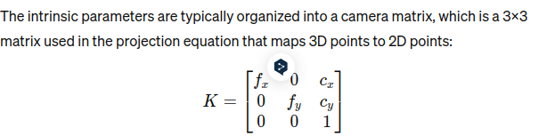

# Note in Frauenhofer project
## Python
### How to understand staticmethod
### How to understand type hint in function 
```python
def greeting(name: str) -> str:
    '''
    # type hint: its been used to indicate the type of the parameter and the return value of the function
    # the type hint is not enforced by the Python interpreter, but it can be used by static analysis tools to check for type consistency
    '''


    return 'Hello, ' + name
```

### How to understand async def
```python
async def fetch_data(url):
    '''
    # async def: it defines an asynchronous function that can perform non-blocking I/O operations
    # it allows the function to pause its execution while waiting for I/O operations to complete
    # it can be used with the await keyword to pause the function and resume it when the awaited operation is complete
    '''
    response = await aiohttp.get(url)
    return response
```

### How to understand open-loop controller
> An open-loop controller is a type of control system that operates without using feedback to determine if its output has achieved the desired goal of the input command or instruction. This means that the controller does not rely on feedback to adjust its output; it simply follows a predefined sequence of operations based on the input it receives.

- Examples of open-loop controllers
  - home heating system
  - traffic light system
  - washing machine

### offset in Isaac sim
> In the context of robotics and simulation, an offset is a value that is added to or subtracted from a position or orientation to adjust its location or orientation relative to a reference point. This can be used to fine-tune the position or orientation of objects in a simulation to achieve the desired behavior or appearance.

### MJCF file is?
> MJCF (MuJoCo XML File) is a file format used by the MuJoCo physics engine to define the properties of a simulated environment, including objects, constraints, and interactions. It is an XML-based format that allows users to specify the parameters of a simulation, such as the size and shape of objects, the forces acting on them, and the physical properties of the environment.

### What is shapeNet?
> ShapeNet is a collaborative project among researchers from several universities, including Stanford University, Princeton University, and Toyota Technological Institute at Chicago. It is a large-scale dataset of 3D shapes, which has been widely used in computer vision and robotics research.


### What is RMP flow?
> RMPflow is a framework designed for motion planning and control in robotics. It stands for Riemannian Motion Policies (RMPs) flow and is based on the concept of Riemannian Motion Policies. The framework was developed to handle the complex interactions and constraints typical in robot motion planning tasks, especially when multiple objectives and dynamic environments are involved.

### What is IK solver?
> An IK solver, or Inverse Kinematics solver, is a crucial component in robotics and animation that calculates the necessary joint configurations to achieve a desired position or orientation of an end-effector or a target part of a system. This is particularly important in complex robotic arms and animated characters where precise control over movement and positioning is necessary.

### Setup a camera in a scene explanation
```python
import carb # Import the CARB library. carb is a module likely related to the Omniverse platform, specifically used for Carbonite scripting. Carbonite is a core component in NVIDIA Omniverse that facilitates scripting and automation tasks. This module might be utilized to interact with low-level functionalities within the Omniverse environment, such as logging, file system operations, and event handling
from omni.isaac.kit import SimulationApp
# 
```

### What is camera intrinsics?
> "camera intrinsics" refer to the internal characteristics of a camera that affect how it captures images. These intrinsic parameters are used to convert the 3D coordinates of a point in the world to the 2D coordinates on the camera's image sensor.

- focal length
- principal point
- distorition coefficients
- camera matrix
- 

### How to use ssh 
#### 1. check for existing SSH keys
```bash
ls -al ~/.ssh
```
#### 2. Generate a new SSH key
```bash
ssh-keygen -t ed25519 -C "email@example.com" # why ed25519? it is a secure elliptic curve algorithm that provides strong security with faster performance compared to other algorithms like RSA

# or we can use RSA
ssh-keygen -t rsa -b 4096 -C "email@example.com"
```

#### 3. Add your SSH key to the ssh-agent
```bash
eval "$(ssh-agent -s)"
ssh-add ~/.ssh/id_ed25519
# or ras model
ssh-add ~/.ssh/id_rsa
```

#### 4. Add the SSH key to your GitHub account
- Copy the SSH key to your clipboard
```bash
cat ~/.ssh/id_ed25519.pub
# or rsa model
cat ~/.ssh/id_rsa.pub
```

- Add the SSH key to your GitHub account
  - Go to your GitHub account settings
  - Click on "SSH and GPG keys"
  - Click on "New SSH key"
  - Paste the copied key into the "Key" field
  - Click "Add SSH key"
#### 5. Test the SSH connection
```bash
ssh -T git@github.com
```

#### 6. Configure Git to use SSH
```bash
git config --global user.name "Your Name"
git config --global user.email "email@example.com"
```

#### 7. clone one repository using SSH in Obsidian by git plugin


 