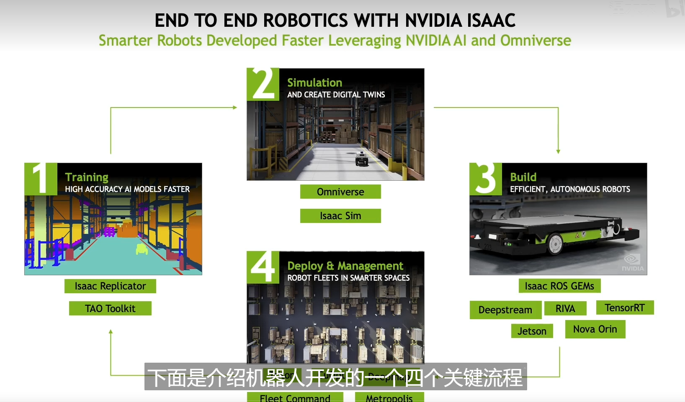

# ISSAC

- Isaac Sim是NVIDIA推出的一个先进的仿真平台，旨在支持机器人学和自动驾驶系统的开发与测试。通过利用物理仿真和虚拟环境，Isaac Sim允许开发人员高效地训练和测试机器人的算法和传感器配置，而无需在现实世界中构建和实验每个场景。这样可以加速开发周期，降低成本，并提高最终产品的安全性和性能。
  

## Four process of dep robot

1. Training
   - Isaac Replicator 合成数据
   - TAO Toolkit 加速
2. Simulation
   - Omniverse 逼近真实场景，逼近算法准确度
   - Isaac Sim
3. Build 在真实场景中， 机器人上部署以及测试
   - ROS GEMS 
   - Deepstream
   - RIVA
   - TensorRT

4. Deploy & Management
   - Triton CuOpt
  

Omniverse的五大组件
1. Omniverse Nucleus 数据存储服务，进行版本管理
2. Omniverse Connect 连接市面上各种主流的三D建模软件
3. Omniverse Simulation
4. Omniverse RTX RENDERER 支持多GPU的渲染
5. Omniverse Kit 可视化的交互式编程

## How in ISAAC SIM
### Take my Robot for a Test Drive
### Interact with ROS Ecosystem
### ADD AI/Training to my Application

## Ros Brigde
- ROS Bridge is a communication interface that allows you to send and receive data between ROS and Isaac Sim.

## Isaac Sim
- NVIDIA Isaac Sim is a scalable robotics simulation application and synthetic data generation tool, built on the NVIDIA Omniverse™ platform. It leverages Omniverse Kit powerful simulation technologies including advanced GPU-enabled physics simulation with PhysX 5, photorealism with real-time ray tracing.

Isaac Sim is a physically accurate virtual environment to develop, test, and manage AI-based robots, and provides the essential features for building virtual robotics experiments.

### Isaac Sim Workflows
#### 1. GUI
> Key features: Visual, intuitive, specialized tools for populating and simulating a virtual world.
> Recommended usage: World building, assemble robots, attach sensors, initialize ROS bridges
#### 2. extensions
> Key features: Run asynchronously to allow interactions with the stage, hot reloading to reflect changes immediately, adaptive physics step for real-time simulation
> Recommended usage: Building interactive GUIs, custom application modules, real-time sensitive applications
- It runs asynchronously. It enables the extension applications to interact with the usd stage without blocking rendering and phsics stepping.
- allow hot reloading change the application code while Omniverse Isaac Sim is running and then see the reflected changes in your application after saving the file, without shutting down or restarting Omniverse Isaac Sim. 
#### 3. Python 
> Key features: control over timing of physics and rendering steps, can be run in headless mode
> Recommended usage: Large scale training for reinforcement learning, systematic world generation and modification
## Container
- "Isaac Sim container"指的是封装了Isaac Sim软件的容器。容器是一种轻量级的、可执行的软件包，其中包含软件的代码、运行时、系统工具、系统库和设置。容器化使得软件可以在任何环境中快速、一致地运行，不受底层基础设施差异的影响。因此，Isaac Sim container使得开发人员可以轻松地在不同的计算环境中部署和运行Isaac Sim，无论是在本地机器上、在数据中心内还是在云平台上。
- only works on Linux
  
