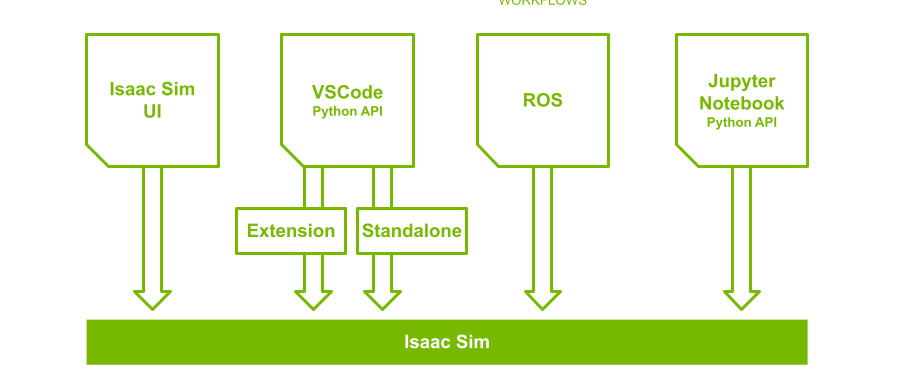

# What is Isaac Sim?
Isaac Sim is a robotics simulation environment that allows you to train and test your robots in a virtual environment. It is based on the Unity3D engine and it is part of the NVIDIA Isaac SDK. It is a powerful tool that allows you to simulate your robots and test your algorithms in a virtual environment before deploying them to the real robot. It is also a great tool for training your robots in a safe environment.

## Development Workflows

## Onmiverse Kit
- A toolkit for  building native Omniverse applications and microservices.
- cpp and python API

## USD
- interchange file format to represent scenes. 
- an 3D scene description and file format for interchange of 3D assets between DCC tools.