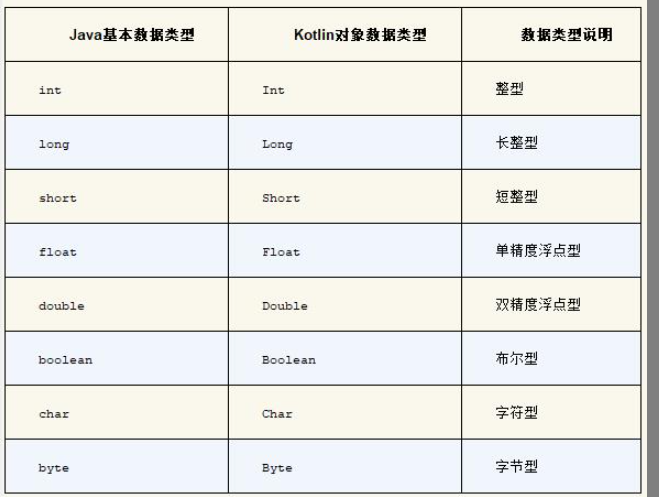
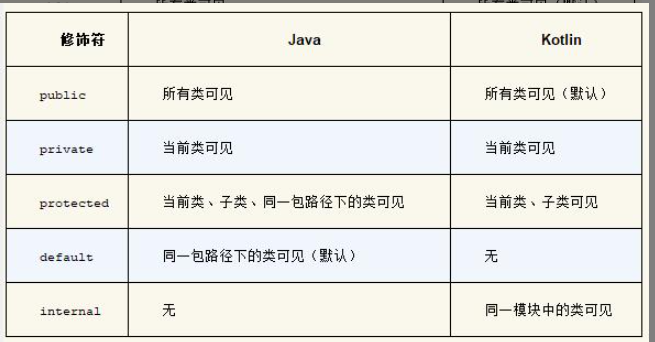

# Kotlin

## Day 2
## Day 2
### Create a kt file to print "Hello World"
- Create a new Kotlin file
  - Right click on the `java` folder
  - Select `New` -> `Kotlin File/Class`
  - Name the file `HelloWorld`
  - ```kotlin
    fun main() {
        println("Hello World")
    }
    ```

### variables in Kotlin
- `val` and `var`
  - `val` is used to declare a read-only variable(like `final` in Java)
    - It can **not be reassigned** after it is initialized
  - `var` is used to declare a mutable variable(like `var` in Java)
    - It can be **reassigned** after it is initialized
  - ```kotlin
    val name = "John"
    var age = 25
    ```
- 显示声明变量类型
  - Kotlin可以自动推断变量类型，但是我们也可以显示声明变量类型
  - ```kotlin
    val name: String = "John"
    var age: Int = 25
    ```
- 
- why we still need `val`
  - To fix unused `final` in Java.
  - Avoiding bugs caused by reassigning variables.

### define functions
- ``` kotlin
  fun main() {
      println("Hello World")
  }
  ```
  starts with `fun`

### Automaticly import packages
- Kotlin can automatically import packages for you

### What is syntactic sugar?
- Syntactic sugar is syntax within a programming language that is designed to make things easier to read or to express.

### Logic of a program
- sequential control
- selection control
  - if
    - It can return a value compared to Java
    - sometimes we can direclty return a value without define a variable
    - an example with syntax sugar
      - ```kotlin
        val result = if (age > 18) "adult" else "child"
        ```
      
  - when
    - it is similar to `switch` in Java, more than switch.
    - In Java. `switch` can only compare with `int` or `String`, every break after a case is necessary.
    - an example with syntax sugar
      - ```kotlin
        val result = when (age) {
            in 0..18 -> "child"
            in 19..60 -> "adult"
            else -> "old"
        }
        ```
    - it support matching tpye.
      - ```kotlin
        val result = when (age) {
            is Int -> "Int"
            is String -> "String"
            else -> "other"
        }
        ```
      - **is** is used to check the type of a variable
    - without parameter in when
      - ```kotlin
        val result = when {
            name.startsWith("Tom") -> 86
            name == "Jerry" -> 90
            else -> 60
        }
        ```
- loop control
  - while
  - for in
  - range ```val range = 1..10``` ```val range = 1 until 10```
    - closed interval : 1..10
    - half-open interval(左闭右开) until
  - step ```for (i in 1..10 step 2)```: 1 3 5 7 9
  - downTo ```for (i in 10 downTo 1)```: 10 9 8 7 6 5 4 3 2 1


### Oriented object programming
#### class and object
- 先将事物封装成具体的类，然后将事物所拥有的属性和能力分别定义成类中的字段和函数。
- 接下来对类进行实例化，然后调用类中的函数，来完成对事物的操作。

#### 继承和构造函数
- 如何继承
  - Kotlin中的类默认是不可以被继承的，如果我们想要继承一个类，那么这个类必须是open的。
  - ```kotlin
    open class Person(val name: String, val age: Int) {
        fun eat() {
            println("$name is eating")
        }
    }
    class Student(name: String, age: Int, val sno: String) : Person(name, age) {
        fun study() {
            println("$name is studying")
        }
    }
    ```
    - 为什么person后面需要加括号
      - 因为Person类有一个构造函数，我们需要将name和age传递给这个构造函数。
- 构造函数
  - 分成两种：主构造函数和次构造函数
  - 主构造函数 是最常用的构造函数，特点是没有函数体，直接跟在类名后面
    - ```kotlin
      class Student(val sno: String, val grade: Int) : Person() {
      }
      // 对student进行实例化的时候，必须要传递sno和grade
      val student = Student("001", 3)
      ```
    - init结构体  
      - 子类的主构造函数调用父类中的哪个构造函数，在继承的时候通过括号来指定。
  - 次构造函数
    - 几乎用不到
    - 任何一个类只能有一个主构造函数，但是可以有多个次构造函数
      - ```kotlin
        class Student(val sno: String, val grade: Int, name: String, age: Int) :
         Person(name, age) {
            constructor(name: String, age: Int) : this("", 0, name, age) {
            }

            constructor() : this("", 0) {
            }
        }
        ```
    - 次构造函数是通过constructor关键字来定义的
    - ```kotlin
      class Student : Person {
          constructor(name: String, age: Int, sno: String, grade: Int) : super(name, age) {
              this.sno = sno
              this.grade = grade
          }
      }
      ```
    - 次构造函数的特点是可以有函数体，可以有多个次构造函数，但是次构造函数必须调用主构造函数或者其他次构造函数。
    - 次构造函数的参数不能有val或者var修饰，因为次构造函数的参数不能作为类的字段。
#### Interface
- 任何一个类只能继承一个父类，但是可以实现多个接口
- 如何理解面向接口编程
  - 一个类可以实现多个接口，这样就可以实现多个接口中的方法
  - 一个接口可以被多个类实现，这样就可以实现多个类中的方法
  - 多态

### 修饰符
- public
  - 默认的修饰符
  - 可以被任何地方访问
- private
  - 只能在当前文件中访问
- protected
  - 只能在当前类和子类中访问
- internal
  - 只能在同一个模块中访问
  
  - 

### 数据格式
- equals()方法用于判断两个数据类是否相等
- hashCode()方法用于返回数据类的哈希码 是equals()方法的辅助方法
- toString()方法用于提供更清晰的输入日志
- An example
  - ```kotlin
    data class Cellphone(val brand: String, val price: Double)

    fun main() {
        val cellphone1 = Cellphone("Samsung", 1299.99)
        val cellphone2 = Cellphone("Samsung", 1299.00)
        println(cellphone1)
        println("cellphone1 equals cellphone2 " + (cellphone1 == cellphone2))
    }
    ```
- data 关键字表示这是一个数据类，数据类是一种特殊的类，它会自动重写equals()、hashCode()和toString()方法。

### 单例模式
- 单例模式是一种常用的软件设计模式，它保证一个类仅有一个实例，并提供一个访问它的全局访问点。
- 如何使用kotlin创建一个单例
- an example
  - ```kotlin
    object Singleton {
      fun singletonTest() {
          println("singletonTest is called.")
      }
    }

    fun main() {
        Singleton.singletonTest()
    }
    ```
- kotlin 在背后自动帮我们创建了一个单例对象，这个对象的名字就是Singleton，我们可以直接通过Singleton来调用它的方法。


### Lambda编程
#### 集合的创建与遍历 
- 集合初始化
  - ```kotlin
    val list = listOf("Apple", "Banana", "Orange") // 不可变集合
    val list = mutableListOf("Apple", "Banana", "Orange") // 可变集合

    val set = setOf("Apple", "Banana", "Orange") // set中不可以有重复元素

    val map = mapOf("Apple" to 1, "Banana" to 2, "Orange" to 3) // map是一种键值对的集合
    // 不建议使用put 和 get 方法对map进行数据操作，更加推荐使用[]操作符
    // map["Apple"] = 1 
    // val value = map["Apple"]

    // 如何遍历map
    for ((fruit, number) in map) {
        println("fruit is $fruit, number is $number")
    }
    ```

#### 集合的函数式API
- An Example: 找到水果当中的最长的名字
  - ```kotlin
    val list = listOf("Apple", "Banana", "Orange")
    val maxLengthFruit = list.maxBy { it.length }
    println("max length fruit is $maxLengthFruit")
    ```

- Lambda就是一小段可以作为参数传递的代码
- 基本表达式为：{参数名1: 参数类型, 参数名2: 参数类型 -> 函数体}
- An Example: 将所有的水果名都变成大写
  - ```kotlin
    val list = listOf("Apple", "Banana", "Orange")
    val newList = list.map { it.toUpperCase() }
    println(newList)
    ```
- filter 用来过滤集合中的元素。
  - ```kotlin
    val list = listOf("Apple", "Banana", "Orange")
    val newList = list.filter { it.length <= 5 }.map { it.toUpperCase() }
    println(newList)

    // 为什么要先使用filter，再使用map？
    // 如果先使用map，那么所有的元素都会被遍历一遍，然后再使用filter，那么所有的元素都会被遍历一遍。但是如果先使用filter，那么只有符合条件的元素才会被遍历。
    ```

- any 用来判断集合中是否有满足条件的元素
- all 用来判断集合中的所有元素是否都满足条件
- none 用来判断集合中是否没有满足条件的元素
- find 用来查找集合中的元素
- An Example
- ```kotlin
  val list = listOf("Apple", "Banana", "Orange")
  val anyResult = list.any { it.length <= 5 }
  val allResult = list.all { it.length <= 5 }
  val noneResult = list.none { it.length <= 5 }
  val findResult = list.find { it.length <= 5 }
  println("anyResult is $anyResult, allResult is $allResult, noneResult is $noneResult, findResult is $findResult")
  ```
- API 文档地址： https://kotlinlang.org/api/latest/jvm/stdlib/kotlin.collections/index.html
  
#### JAVA中的函数式API使用
- Runnable
  - ```kotlin
    public interface Runnable {
        void run();
    }
    ```
  - Runnable 接口主要结合线程使用，用来定义一个任务，然后交给线程去执行。
  - ```Java
    // 一个子线程 Java
    new Thread(new Runnable() {
        @Override
        public void run() {
            System.out.println("Thread is running");
        }
    }).start();
    ```
  - ```kotlin
    // 一个子线程 Kotlin
    Thread（object : Runnable） {
        println("Thread is running")
    }.start()

    // 更简介的写法
    Thread {
        println("Thread is running")
    }.start()
    ```
### 空指针检查
- Why
  - Android 系统上崩溃率最高的异常类型就是空指针异常
  - 空指针是一种不受编程语言检查的运行时异常
- What
  - An Example
  - ```Java
    String name = null;
    System.out.println(name.length());
    ```
- How
  - ```kotlin
    var name: String? = null
    println(name?.length)
    ```
  - 通过?来进行空指针检查，如果name为空，那么就不会执行length方法，也不会崩溃。
  - 通过?:来进行空指针检查，如果name为空，那么就会返回?:后面的值。
  - ```kotlin
    var name: String? = null
    println(name?.length ?: -1)
    ```
  - !!操作符
    - 如果我们确定一个变量不为空，那么可以使用!!操作符，这样就不会进行空指针检查。
    - ```kotlin
      var name: String? = null
      println(name!!.length)
      ```
    - 如果name为空，那么就会抛出空指针异常。
  - let函数
    - ```kotlin
      var name: String? = null
      name?.let {
          println(it.length)
      }
      ```
    - 如果name不为空，那么就会执行let函数中的代码。
  - ?:操作符
    - ```kotlin
      var name: String? = null
      val length = name?.length ?: -1
      println(length)
      ```
    - 如果name为空，那么就会返回-1。
  - as?操作符
    - ```kotlin
      var name: String? = null
      val length = name as? Int
      println(length)
      ```
    - 如果name不是Int类型，那么就会返回null。
  - ?.let
    - ```kotlin
      var name: String? = null
      name?.let {
          println(it.length)
      }
      ```
    - 如果name不为空，那么就会执行let函数中的代码。
  - ?.also
    - ```kotlin
      var name: String? = null
      name?.also {
          println(it.length)
      }
      ```
    - 如果name不为空，那么就会执行also函数中的代码。
  - ?.run
    - ```kotlin
      var name: String? = null
      name?.run {
          println(length)
      }
      ```
- 可为空类型系统的写法
  - ```kotlin
    // 在类名/变量后面加上?表示这个类可以为空
    var name: String? = null
    var length = name?.length ?: -1
    println(length)

    fun doStudy(study: Study?) {
    if (study != null) {
        study.readBooks()
        study.doHomework()
    }
    }
    ```
- 判空辅助工具
- ```kotlin
  // 通过?.判断
  a?.doSomething()
  // doStudy
  fun doStudy(study: Study?) {
      study?.readBooks()
      study?.doHomework()
  }
  // 通过?:判断 这个操作符左右两边都接受一个表达式，如果左边的表达式不为空，那么就返回左边的表达式，如果左边的表达式为空，那么就返回右边的表达式。
  val c = a ?: bf
  // 结合使用？和?:
  fun getTextLength(text: String?): Int {
      return text?.length ?: 0
  }
  // 通过!!判断 如果我们确定一个变量不为空，那么可以使用!!操作符，这样就不会进行空指针检查。
  
  fun printUpperCase() {
    val upperCase = content!!.toUpperCase()
    println(upperCase)
  }
  // let函数
  obj.let { obj2 ->
      // obj2不为空的时候执行
  }
  // let函数是可以处理全局变量的判空问题
  ```

### kotlin魔法工具
  #### 字符串内嵌表达式
  - An Example
  - ```kotlin
    val brand = "Samsung"
    val price = 1299.99
    val discount = 0.8
    println("Cellphone(brand=$brand, price=$price, discount=${price * discount})")
    ```
#### 函数的参数默认值
- kotlin提供了可以通过键值对的方式进行参数传递
- An Example
- ```kotlin
  printParams(str = "hello", num = 100)
  fun printParams(num: Int, str: String) {
      println("num is $num, str is $str")
  }
  ```


      