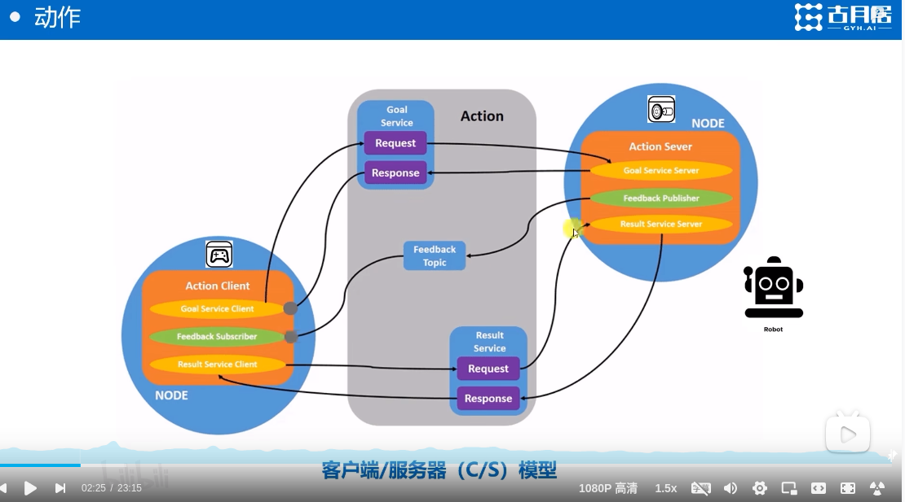
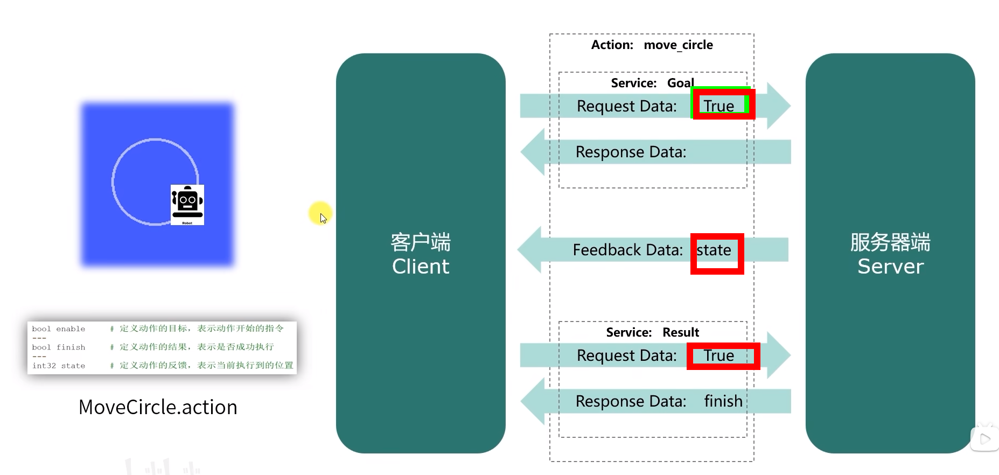
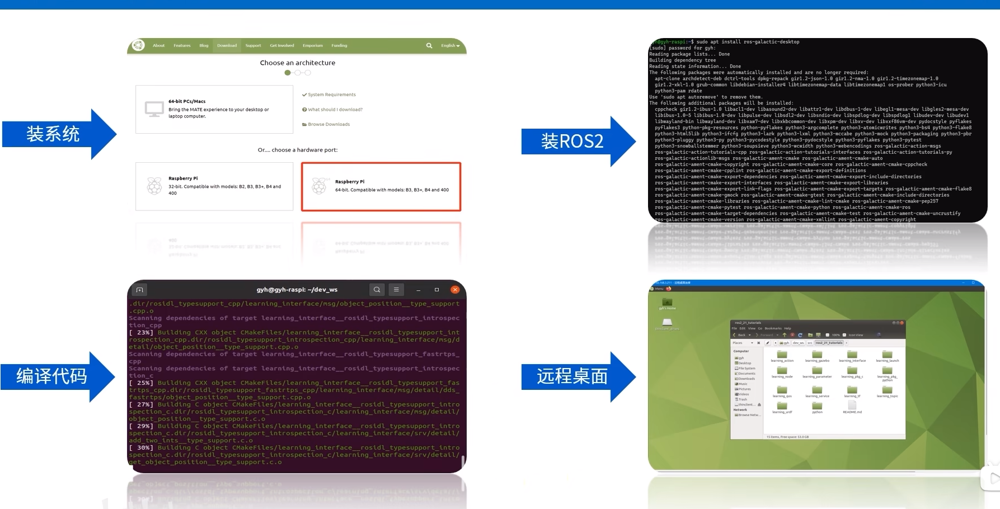
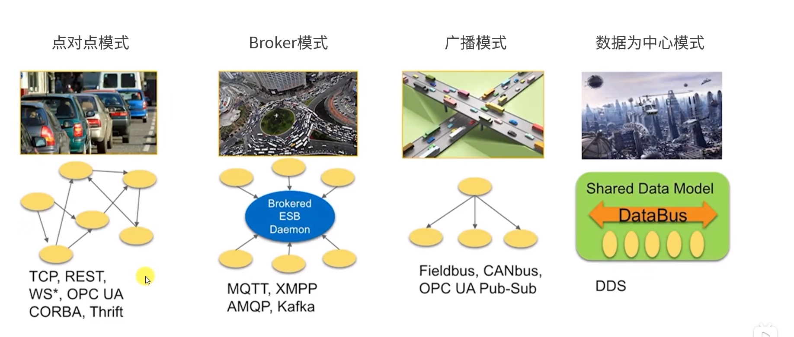
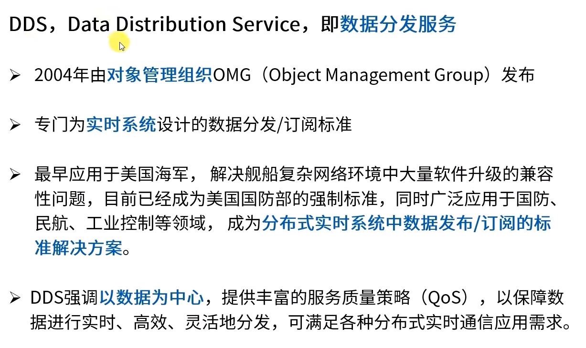

# Day3

## Topic
### 动作：完整行为的流程管理
   
> 动作是应用层的通信机制
> 其地层就是基于话题和服务来实现 
#### 实现一个机器人画圆的动作

  - enable
  - finish
  - state
### The difference between from and import in python
- 共同点
  - 都用于倒入模块到当前的命名空间,以便可以直接使用模块中的函数和变量
- 不同点
  - import 用于导入整个模块,需要通过模块名来访问模块中的函数和变量
  - from...import 用于导入模块中的指定函数和变量,可以直接使用这些函数和变量,而不需要通过模块名来访问
  - such as import math, math.sqrt(4) and from math import sqrt, sqrt(4)
- 使用 import 由于需要通过模块名来访问属性，因此可以避免属性名冲突
- 当导入模块较小，或者确实需要模块中大部分的功能时，使用 import
- 当只需要模块中部分功能，或者模块中的属性名可能会和当前命名空间中的属性名冲突时，使用 from...import

### 机器人系统的全局字典
> 参数类似于C语言的全局变量.可以在多个节点当中访问和使用
- 参数
  - 全局共享字典
  - 由键值组成
  - 可实现动态监控

- 查看ros2 参数
  ```shell
  ros2 param
  ros2 param list
  ros2 param describe turtlesim background_b // 查看参数的描述
  ros2 param get turtlesim background_b // 获取参数的值
  ros2 param set turtlesim background_b 255 // 设置参数的值
  ```
- You should set the parameters in a init file.
```shell
// print the parameters
ros2 param dump turtlesim
// set the parameters to the ini file(重定向保存)
ros2 param dump turtlesim >> turtlesim.yaml
// why yaml file -> easy understanding

```

- load the parameters from the ini file
```shell
ros2 param load turtlesim turtlesim.yaml
```

### 分布式通信:多计算平台的任务分配
> 将自动化任务分配到多台计算平台上能够减轻单台计算平台的负担，提高整体的运行效率

- 树莓派
  - 电机驱动,传感器采集
- PC
  - 可以进行复杂的算法计算,图像处理,图像识别等

#### 树莓派配置


- ip adress on linux
- ipconfig on windows
- ssh pi@
- ifconfig on linux
  
#### 分布式DOMAIN配置
- make sure both devices are in the same wifi
- login raspberrypi on linux
  ```shell
  ssh gyh@192.168.3.211 // modify based the real name and ip address
  ```

- 分组通讯
  ```shell
  // on rasppi, modify the bashrc file
  vi ~/.bashrc
  export ROS_DOMAIN_ID=30
  :wq
  source ~/.bashrc


  // on PC, modify the bashrc file
  same as above
  ```

### DDS: 机器人的神经网络
> 常用的通信模式
> 

#### DDS
- Data Distribution Service 数据分发服务
- 
- 在命令行中配置参数
  ```shell
  ros2 topic pub /msg_name msg_type "data" 
  ```
- 在python中配置参数
  ```python
    from msg_name.msg import MsgType
    from rclpy.qos import QoSProfile, QosReliabilityPolicy, QosHistoryPolicy
    
    class PublisherNode(Node):
      def __init__(self):
        super().__init__("publisher_node")
        qos_profile = QoSProfile
        (
          reliability=QosReliabilityPolicy.BEST_EFFORT,
          history=QosHistoryPolicy.KEEP_LAST,
          depth=10
        )
        self.pub = self.create_publisher(String, "chatter", qos_profile) 
        self.timer = self.create_timer(0.5, self.timer_callback)

      def timer_callback(self):
        msg = String()
        msg.data = "Hello World: %d" % self.i
        self.pub.publish(msg)
        self.get_logger().info("Publishing: '%s'" % msg.data)
        self.i += 1
  ```

### Launch: 多节点启动与配置脚本
> 需求: 想要一次性启动多个节点
> 方案: 使用launch文件
#### Launch文件
- launch文件看起来像是python文件
- 像粘合剂一样可以自由组织workflow

- example 
  ```python
  ros2 launch learning_launch simple_launch.py
  ```
- simple_launch.py
  ```python
  from launch import LaunchDescription           # launch文件的描述类
  from launch_ros.actions import Node            # 节点启动的描述类

  def generate_launch_description():             # 自动生成launch文件的函数
      return LaunchDescription([                 # 返回launch文件的描述信息
          Node(                                  # 配置一个节点的启动
              package='learning_topic',          # 节点所在的功能包
              executable='topic_helloworld_pub', # 节点的可执行文件
          ),
          Node(                                  # 配置一个节点的启动
              package='learning_topic',          # 节点所在的功能包
              executable='topic_helloworld_sub', # 节点的可执行文件名
          ),
      ])
  ```

