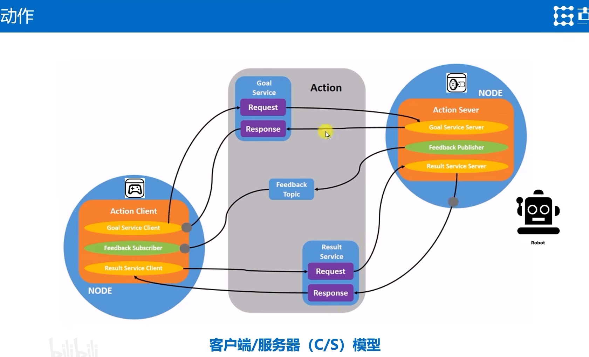
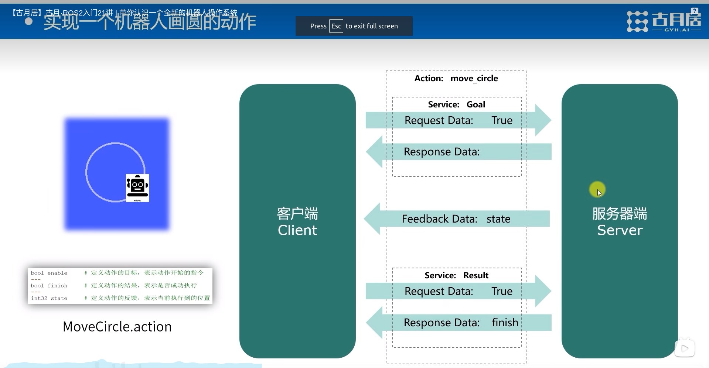

# ROS2_Day3
## 通信接口：数据传递的标准结构
> 什么是通信接口？
> 通过接口，服务端和客户端可以进行数据传递。
> 接口让程序之间的依赖降低，方便不同用户和开发者之间的代码互用
> ROS的核心目标:减少重复造轮子.

### 通信接口的定义方式
- .msg文件：定义消息类型
- .srv文件：定义服务类型
- .action文件：定义动作类型

### 通过命令行也可以查看常用的通信接口
```shell
    ros2 interface list
    ros2 interface show geometry_msgs/msg/Twist
    ros2 interface show turtlesim/srv/Spawn
    ros2 interface show turtlesim/action/RotateAbsolute
    ros2 interface show package learning_interface
    ros2 interface show sensor_msgs/msg/Image
```


### 话题topic会周期性返回消息

## 动作: 完整行为的流程管理


## TF 坐标变换
### 


