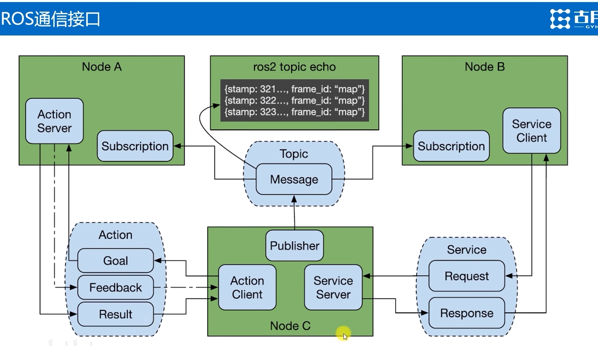

# ROS2_Day3
## 通信接口：数据传递的标准结构
> 什么是通信接口？
> 通过接口，服务端和客户端可以进行数据传递。
> 接口让程序之间的依赖降低，方便不同用户和开发者之间的代码互用
> ROS的核心目标:减少重复造轮子.

### 通信接口的定义方式
- .msg文件：定义消息类型
- .srv文件：定义服务类型
- .action文件：定义动作类型

### 通过命令行也可以查看常用的通信接口
```shell
    ros2 interface list
    ros2 interface show geometry_msgs/msg/Twist
    ros2 interface show turtlesim/srv/Spawn
    ros2 interface show turtlesim/action/RotateAbsolute
    ros2 interface show package learning_interface
    ros2 interface show sensor_msgs/msg/Image
```


### 话题topic会周期性返回消息

## 动作: 完整行为的流程管理


## TF 坐标变换
### buffer 缓冲区 可以缓存一段时间内的坐标变换的信息
### python 当中的try except 语句
```python
```
### 四元素变成欧拉角
- 四元素 姿态信息
```python
import tf2_ros
import geometry_msgs.msg
euler = tf2_ros.transformations.euler_from_quaternion([0, 0, 0, 1])
```

### 海龟跟随功能的实现
- 三个坐标系
  - world 坐标系
  - turtle1 坐标系
  - turtle2 坐标系


- TF 动态广播与监听
### 节点复用方式 
- 通过改变参数来实现节点的复用
```python
Node(
    package='turtlesim',
    executable='turtlesim_node',
    name='turtlesim1',
    output='screen',
    parameters=[{'background_b': 255, 'background_g': 255, 'background_r': 255}]
),
Node(
    package='turtlesim',
    executable='turtlesim_node',
    name='turtlesim2',
    output='screen',
    parameters=[{'background_b': 0, 'background_g': 0, 'background_r': 0}]
),
```

### following_turtle.py
```python
```
- 第二只海龟 通过 spwan 服务生成
```python
    self.spawner = self.create_client(Spawn, 'spawn')
    self.turtle_spawning_service_ready = False
    self.turtle_spawned = False
```
 


