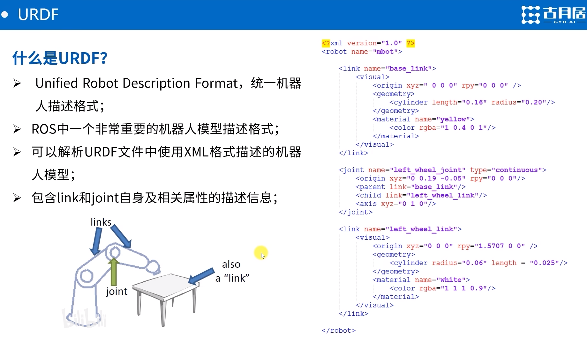

# URDF 机器人建模方法
## What is URDF
> 用来描述机器人的一种XML文件格式，URDF文件包含了机器人的各种信息，例如：机器人的连杆、传感器、关节、碰撞体、惯性体等。URDF文件是ROS中机器人建模的基硃，它是一种XML文件格式，用来描述机器人的各种信息，例如：机器人的连杆、传感器、关节、碰撞体、惯性体等。URDF文件是ROS中机器人建模的基硃，它是一种XML文件格式，用来描述机器人的各种信息，例如：机器人的连杆、传感器、关节、碰撞体、惯性体等。

## 四大组成部分
- 硬件结构
- 驱动系统
- 传感系统
- 控制系统

