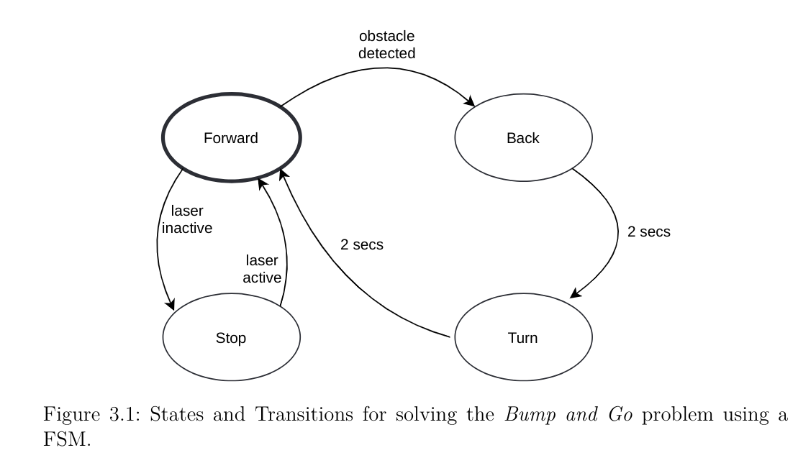

# First Behavior: Avoiding Obstacles with Finite State Machine
## FSM: Finite State Machine
- 一种用于表示和控制执行流程的模型
- we can use it to define the behavior of the robot

## transitions between states
- connection 
- condition

### perception and acu