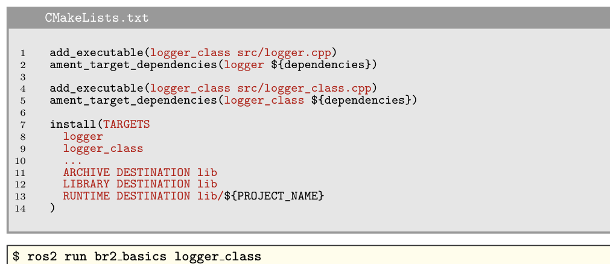
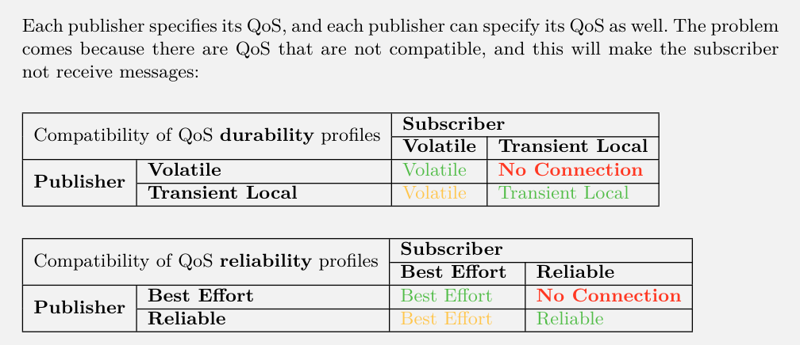

# ROS2

## Cmake
### Day1 
#### add_executable
for executable 
```cmake
add_executable(executable_name source_file.cpp)
```
for ament_target_dependencies
```cmake
ament_target_dependencies(executable_name rclcpp)
```

an install instruction:


#### create_wall_timer
Its been used to create a timer that will call a callback at a specified interval.
```cpp
auto timer = node->create_wall_timer(std::chrono::seconds(1), timer_callback);
```

#### Understanding publisher
```cpp
auto publisher = node->create_publisher<std_msgs::msg::String>("topic", rclcpp::QoS(10).transient_local().best_effort());
```

#### no connection sutiation between publisher and subscriber


#### code see what we are publishing in the topic
```bash
ros2 topic echo /topic_name
```

#### code explaination
```cpp
subscriber = node->create_subscription<std_msgs::msg::Int32>("int_topic", 10, std::bind(&MinimalSubscriber::topic_callback, this, _1));
// std::bind is used to bind the callback function to the class member function.
RCLCPP_INFO(node->get_logger(), "Hello %d", msg->data);
//%d is a placeholder for an integer value. for example, if msg->data is 42, the output will be "Hello 42"


```
#### launcher 
- It is written in python
- It is used to launch multiple nodes at once
- It can include another launch file
- launched simultaneously, one by one.

#### spin in the main function
spin is used to keep the node running until it is interrupted by a signal.

#### how to check the topic
```bash
ros2 topic list
```

#### how to understand the twist message
- It is a message that contains linear and angular velocity.
- It is used to control the movement of a robot.
  
