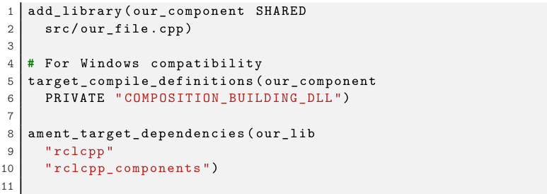
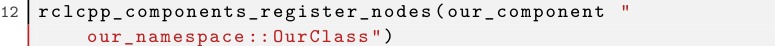

# Ros2
## Node
### two ways to create a node
1. Using `rclcpp::Node::make_shared` function
```cpp
auto node = rclcpp::Node::make_shared("node_name");
```
2. create a class that inherits from `rclcpp::Node`
```cpp
class NodeName : public rclcpp::Node
{
public:
  NodeName()
  : Node("node_name")
  {
  }
};
```
> advantages of using the second method: 
> - Its easier to isolate it into a library and use it in multiple nodes
> - the execution of a node can be controlled at runtime.

### Components and when to use them
> Components are the recommended way to create nodes in ROS2. Once a Node is created, its execution can(optionally) be controlled by an executor, who can run multiple components at the same time.
#### How to make a class a component
1. write a class that inherits from `rclcpp::Node`, register it as a component using RCLCPP_COMPONENTS_REGISTER_CLASS macro

2. modify the `CMakeLists.txt` file to include the component



### Executor
> An executor is a class that can run multiple components at the same time. It can be used to control the execution of a node.
> It has a **lunch** file that can be used to run multiple components at the same time.