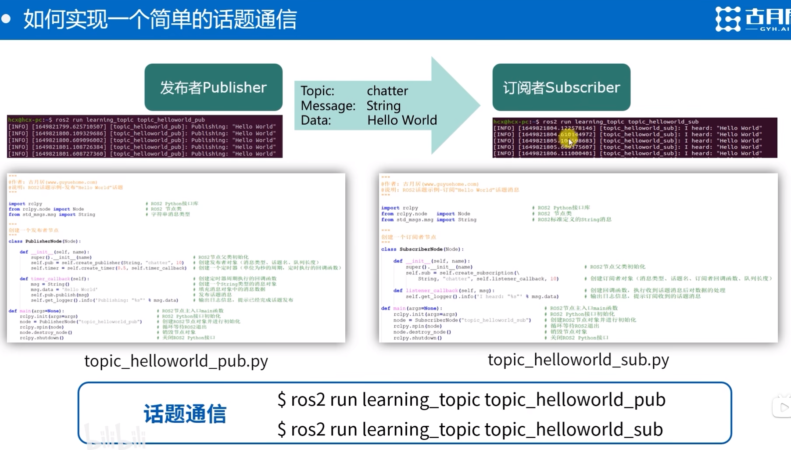
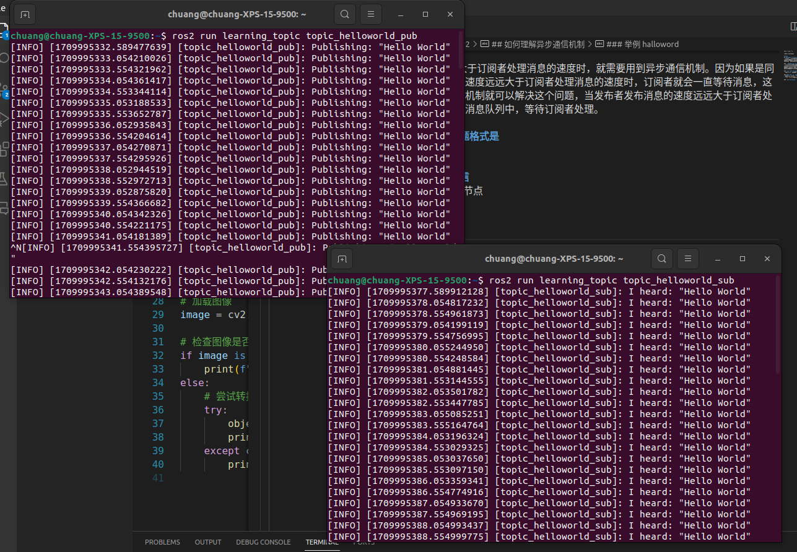
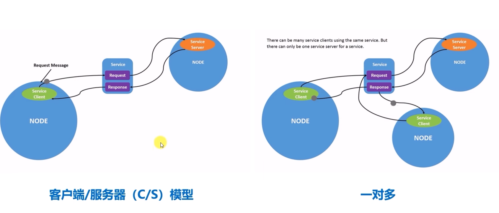
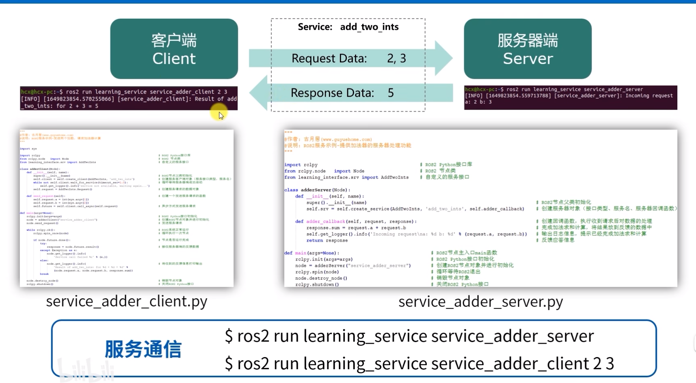
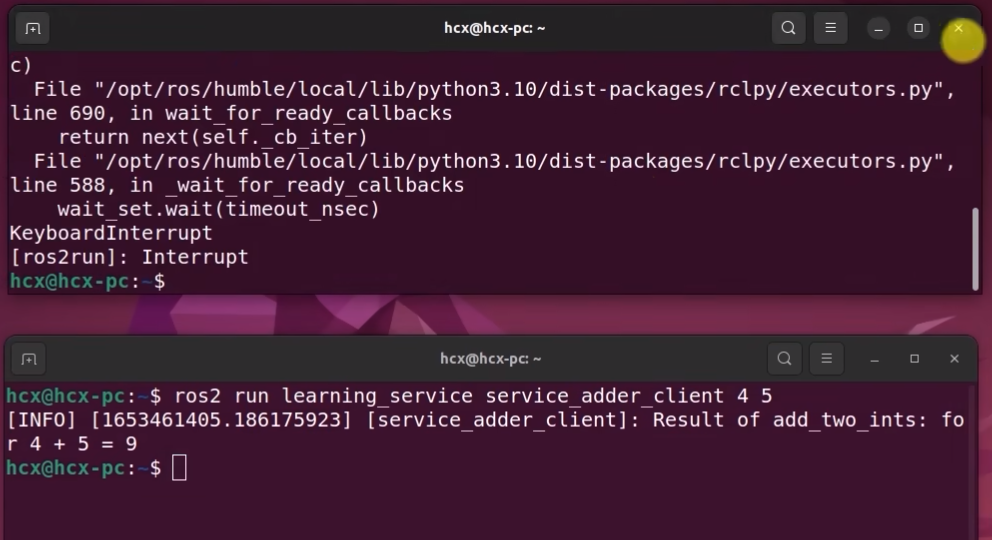

ctrl + alt + T 

用来启动terminal

# Day2
## 如何理解异步通信机制
- 发布者和订阅者之间的通信是异步的，发布者和订阅者之间是通过消息队列进行通信的，发布者发布消息到消息队列，订阅者从消息队列中取出消息进行处理。它们两者并不知道对方什么时候发送消息，也不知道对方什么时候接收消息，这就是异步通信机制。

### 什么时候用到异步通信机制
- 当发布者发布消息的速度远远大于订阅者处理消息的速度时，就需要用到异步通信机制。因为如果是同步通信机制，当发布者发布消息的速度远远大于订阅者处理消息的速度时，订阅者就会一直等待消息，这样就会导致消息丢失。而异步通信机制就可以解决这个问题，当发布者发布消息的速度远远大于订阅者处理消息的速度时，消息就会存储在消息队列中，等待订阅者处理。

### ros2中的异步通信机制 话题格式是 
- msg格式是 .msg文件

### 如何实现一个简单的话题通信
- 需要创建 发布者和订阅者两个节点
- 
  
### 举例 halloword 


### 创建话题发布者的程序流程
- 编程接口初始化
- 创建节点并初始化
- 创建发布者对象
- 创建并填充话题消息
- 发布话题消息
- 销毁节点并关闭接口
- **需要在setup中设置entry point**

### 创建话题订阅者的程序流程
- 编程接口初始化
- 创建节点并初始化
- 创建订阅者对象
- 回调函数处理话题数据 
- 销毁节点并关闭接口

### 一个模块化的例子
- 为什么需要模块化
  - 代码复用
  - 代码维护
  - 代码可读性
  - 举例
    - 创建一个摄像头节点作为发布者，创建一个图像识别节点作为订阅者。
  - 当未来升级了摄像头，则只需要更改摄像头节点，而不需要更改图像识别节点。这种模块化的设计可以提高代码的可维护性和可扩展性。

### WHy we need CvBridge
- The data from Ros2 is different from OpenCV, so we need to convert the data from Ros2 to OpenCV format.
- CvBridge is a package that can convert the data from Ros2 to OpenCV format. 
- ```python
    from cv_bridge import CvBridge

    bridge = CvBridge()
    ```


### Without updating the camera node, it can work with changing camera models.
- ``` sudo apt install ros-humble-usb-cam ```
- ``` ros2 run usb_cam usb_cam_node_exe ```
- ``` ros2 run learning_topic topic_webcam_sub ```   

- 只需要安装支持usb标准的相机驱动

## 同步通信机制
> 更像是一个你问我答的过程。当发布者发布消息时，订阅者会立即处理消息，然后发布者才会发布下一条消息。这样就保证了消息的完整性，不会丢失消息。
> 简称为C/S 模型 服务器和客户端模型

- 服务器唯一，客户端可以不唯一
- .srv文件 服务文件



### 一个简单的加法求解器



### spin语法
- spin()函数是一个阻塞函数，它会一直阻塞在这里，直到有消息到来。当有消息到来时，它会调用回调函数处理消息，然后继续阻塞，等待下一条消息到来。这样就保证了消息的完整性，不会丢失消息。
- spin_once()函数是一个非阻塞函数，它会立即返回，然后继续处理其他的服务请求。当有消息到来时，它会调用回调函数处理消息，然后返回。这样就可以提高服务请求的处理效率。

### sys.argv[1] 用来获取命令行参数
- sys.argv[0] 是文件名
- sys.argv[1] 是第一个参数
- sys.argv[2] 是第二个参数
  

### 为什么要异步方式发送服务请求?
- 当服务请求的处理时间较长时，如果使用同步方式发送服务请求，那么客户端会一直等待服务请求的处理结果，这样会导致客户端无法处理其他的服务请求。而异步方式发送服务请求，客户端会立即返回，然后继续处理其他的服务请求，这样就可以提高客户端的处理效率。

### 什么时候使用异步方式, 什么时候使用同步方式?
- 当服务请求的处理时间较短时，可以使用同步方式发送服务请求，这样可以保证服务请求的处理结果的完整性。当服务请求的处理时间较长时，可以使用异步方式发送服务请求，这样可以提高客户端的处理效率。

### rclpy.ok() 用来判断节点是否还在运行

### node.futures.Future() 用来创建一个Future对象
- Future对象是一个异步对象，它可以用来处理异步任务。当异步任务完成时，Future对象会返回一个结果。
- 如何理解Future
- node.future.done() 用来判断异步任务是否完成

### call_async() 用来异步发送服务请求
- call_async()函数是一个异步函数，它会立即返回，然后继续处理其他的服务请求。当服务请求的处理结果返回时，它会调用回调函数处理服务请求的处理结果。
- 对应的是**call()**函数，call()函数是一个同步函数，它会一直阻塞在这里，直到服务请求的处理结果返回。当服务请求的处理结果返回时，它会返回服务请求的处理结果。


### 实现一个复杂的服务请求
- ```ros2 run usb_cam usb_cam_node_exe```
- ```ros2 run learning_service service_object_client```
- ```ros2 run learning_service service_object_server```
- > 客户端向服务端发送一个目标跟踪的请求,如果需要跟踪时,向服务器发送一个请求.服务器会发一个当前的位置.
- #### client
  1. ROS2节点主入口main函数
  2. ROS2 Python接口初始化
  3. 创建节点并初始化
  4. 循环等待ROS2退出
  5. 销毁节点对象
  6. 关闭ROS2 Python接口
- #### server