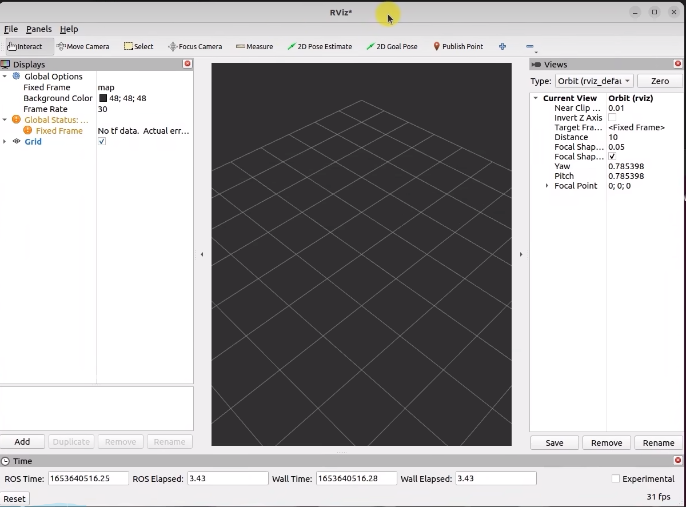
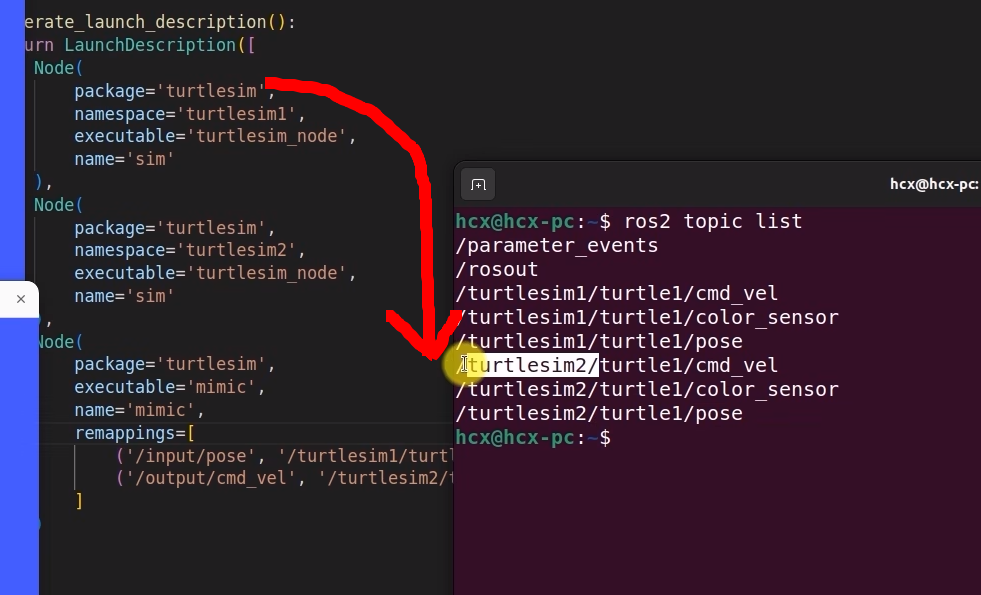

# Day4
## Launch文件：实现多节点的配置和启动
### rviz2: 3D可视化工具
```shell
ros2 run rviz2 rviz2
```

- os.path.join 用于拼接路径
- example: 
```shell
os.path.join('home','user','ros2_ws','src','package_name','launch','rviz2.launch.py') 
'home/user/ros2_ws/src/package_name/launch/rviz2.launch.py'
```
- 查询后台话题有哪些?
```shell
ros2 topic list
```

- namespace: 用于区分不同的节点
### remapping: 重映射
- 重映射的作用: 用于修改节点的输入输出
- 重映射的格式: 
```shell
ros2 run package_name node_name --remap from_name to_name
```
### mimic: remapping
