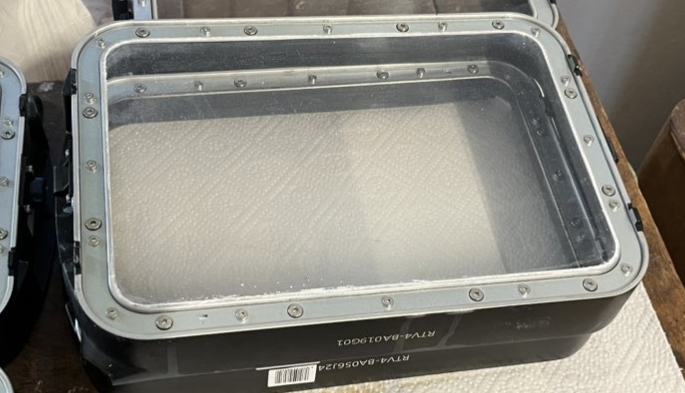

# 3D Printing User Manual

---

This is the user manual for the 3D Printing hardware and software. It contails Software and Hardware requirements, installation instructions, and a guide to using the software.

---

## Environment
---
### Hardware
| Devices          |  Image |  Materials |  Doc Link |
| ---------------- | -------- | -------- | -------- |
| AccuFab-L4D   |   |   | [AccuFab-L4D](https://www.shining3ddental.com/solution/accufab-l4d/) |
| AccuFab-CEL   |  |    | [AccuFab-CEL](https://www.shining3ddental.com/solution/accufab-cel//) |
| AccuFab-L4K   |    |    | [AccuFab-L4K](https://www.shining3d.com/solutions/accufab-l4k-de/) |

### Software
You can download the required software for your 3D printing device from the following link:
[Download Accu](https://support.shining3ddental.com/en/support/solutions/articles/60000716500-download-accuware)

## How to prepare printing
---
### Hardware Setting
1. Connect the printer to the power supply.
2. prepare the printing material such as S2
3. Make sure the tank is clean and dry.
4. Put the material into the tank. Make sure the material is enough(stay above the medium level line, but below the max level line)
### Print Setting
1. Printer Series
> select the available printer series from the list.
1. Printer Serial No.
> click Accu Settrings to import Printer Profile. Then you add see the printer Serial No.

    In R&D Wiki, go folder /1. Resources/1.0Internal/
1. Material. select S2 as Default. Mode select 0.05 as Default.

### Open File
1. Click Open File to import the file you want to print.(.stl, .obj, .beb are supported)
2. 
### Layout
1. Click Layout to adjust the position of the model.
### Support 
1. Click Support to add support to the model.
2. Try to find the best angle to add support. 
### Slice
1. Click Slice to slice the model.
2. Save the print file to the USB disk or desktop.
   
## Printing
---
### USB way
1. Copy the print file to the USB disk.
2. Insert the USB disk to the printer.(use the printer which you have selected in the print setting)
3. Start printing on machine.
### Wlan way
1. Connect the printer to the same network as your computer.

2. Import the print file to online printer.
3. Send the file.

## Washing
---
### 1. Using gloves get the printed model out of the printer. 
### 2. Cutting the support in a write box

### 3. Put the model without support into the washing machine.

- Connect it with the power supply.
- Set five minutes washing for each side of the model.
- Use ==gloves== in whole process.

### 4. Drying
- Set 15 minutes drying for each model.

## Attention
---
1. Use gloves in the whole process.
2. Try to design the model with best size and angle to save the printing time and material.
3. Wash Hands after the whole process. 
