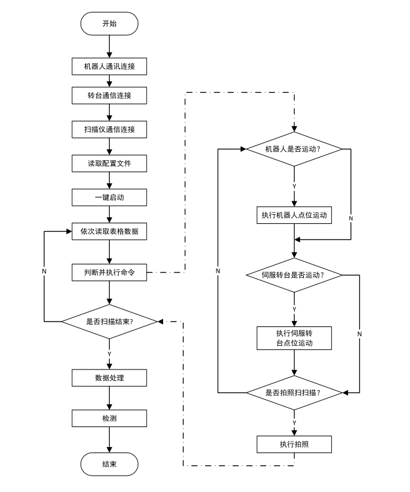

# IQC_插件及源码开发文档
## 1. 插件开发
### 1.1 流程图解释

### 1.2 节点设计
为此流程设计三个节点：IQC_ConfDlg, IQC_Scan, IQC_Inspection
#### 1.2.1 IQC_ConfDlg
- 作用：为扫描检测工程配置参数，包含：机械臂运动位置信息，转台角度，转台补偿值设置以及保存配置文件
#### 1.2.2 IQC_Scan
- 作用：扫描检测工程，包含：机械臂运动，转台旋转，图像采集，图像处理，数据保存
- 图像采集，图像处理及数据保存由蓝光软件处理。节点只是在蓝光软件中调用相应的功能，模拟人工操作。
#### 1.2.3 IQC_Inspection
- 作用：检测扫描文件，包含：导入扫描文件，根据模板处理检测任务，数据保存
## 2. 开发 
### 2.1 开发环境
- 开发工具：Visual Studio 2017，Qt 5.12.8
- 开发语言：C++
- 插件使用平台：QuickNode
- 环境配置：需要准备Han机械臂，松下转台A6系列，蓝光扫描软件，并都已连接成功。检测软件InspectionAppBasic.exe
### 2.2 开发思路
- IQC_ConfDlg节点开发
  - 通过QT设计界面，实现配置参数的输入和保存
  - 连接阶段，需要连接Hans机械臂，松下转台A6系列
  - 点位读取阶段，增加按钮用于读取当前机械臂六轴信息，转台角度信息
  - 修改阶段，在表格中逐行修改点位信息，所有点位无误，可以保存该配置文件。
- IQC_Scan节点开发
  - 节点采用单线程模式，无界面通讯。
  - 工作流程为
    - 读取配置文件，逐行读取配置文件
    - 机械臂首先运动至扫描位置
    - （根据配置文件信息）判断转台是否需要旋转
    - （根据配置文件信息）判断5MP是否需要拍照
- IQC_Inspection节点开发
  - 工作流程
    - 通过命令行方式调用Inspection软件。命令行参数参加Inspection开发文档
    
    ```shell
    
    # 参数说明
    # Test.SNIProj: 扫描模板
    # standard_reload.stl: 扫描文件
    # testReport.csv: 检测报告
    # 0: 0表示正常运行，1表示运行完关闭
    # 如果以上文件路径中有空格，需要用双引号括起来
    
    InspectionAppBasic.exe Test.SNIProj standard_reload.stl testReport.csv 0
    ```
   - 检测软件运行结束后，自动打开检测报告供用户查看。
