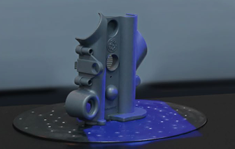

# RobotScan User Manual

## 1. Device Introduction

The RobotScan is an intelligent 3D detection system that replaces manual labor with machinery for fully automatic, standardized 3D scanning. It quickly obtains accurate 3D data of workpieces and performs real-time online detection, outputting detection reports.

| Equipment | Description |
| --- | --- |
| Combo |Scanner|
| Object to be scanned | The object you want to scan |
| Turntable | Used to rotate the object during scanning |
| Hans robot arm | Used to move the scanner around the object |
| Power supply | To power the RobotScan device |
| Computer with QuickNodes software installed | To control the scanning process and process the data |
| Prepared project file (robotscan_demo.qn) | The project file for the scanning process |

## 2. Operation Guide
This Demo is a example of how to use the RobotScan to scan an object. The object is placed on the turntable and the robot arm brings the combo scanner to scan the object. The scanner will move around the object to get the 3D data. The data will be processed and saved in the computer.
### Step1: Device Setup

1. Prepare the object to be scanned. Place the object at the center of the turntable. If necessary, secure the position of the object to be scanned.

2. Connect the power supply and turn on the device. 
3. Turn on the Hans robot arm.
### Step2: Launch QuickNodes
1. Open the QuickNodes software on the computer.
2. Open the prepared project file(robotscan_demo.qn).
3. Check the node parameters settings.
   
   - FS_Initialize
     - Device: The device to be initialized. set as "Combo". 
        > Note: If you want set other Device, make sure you have the holders for the devices.
    - FS_SetScanningMode
      - ScanningMode: The scanning mode of the scanners. set as "LASER".
    - FS_CreateNewProject
      - Project Path: The path to save the project file. set as "D:/RobotScan/Project".
    - FS_SetScanParameters
      - Photogrammetry: The photogrammetry mode. set as "ture".
      - Scan Markers: The markers for the scanning. set as "true".
      - Scan Point Cloud: The point cloud for the scanning. set as "true".
    - FS_StartScan
      - no parameters need to be set.
    - IQC_Robotscan
       - PosPath: The path of the position file for the Hans robot arm. set as "robotscan_demo.csv".
       - robotIP: The IP address of the Hans robot arm. set as " 192.168.0.10 ". 
       - robotPort: The port of the Hans robot arm. set as " 10003 ".
     - FS_EndScan, FS_Release
       - no parameters need to be set.
     - FS_SaveScan
       - File Name: The name of the scan file. set as "robotscan_demo".
       - Save as ASC: Save the scan file as ASC format. set as "true".
       - others parameters set as default.
### Step3: Execute Running
1. Click the "execute" button to start the scanning process.
### Step4: Processing Data
1. After the scanning process is completed, the data will be processed and saved in the computer.
## 3. Turn off the Device
1. Turn off the Hans robot arm.
2. Turn off the Combo.
3. Turn off the power supply.

