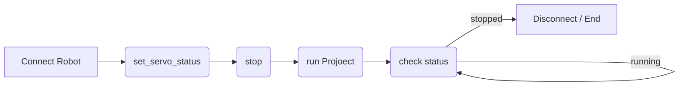

# Robot Elite

## Workflow


- Connect Robot
  - Inputs(IP Address, Port)
- Set Servo Status
  - set Servo Status to True
- Stop
  - stop any running project
- Run Project
  - input: file name on robot
- Check Status
  - check the status of the robot
  - if stopped, end
  - if running, check again
- End
  - Node end


## Plugin Dev(/Source Code)
C++
```cpp

//Parse ip and projectName from properties
std::vector<std::string> properties{ "Elite_Ip", "Elite_Project" };
std::string data = property("Elite_Ip");
std::string ip = getValue<std::string>(data);
data = property("Elite_Project");
std::string projName = getValue<std::string>(data);

// connect Robot
bool rc1 = elite.connectToController(ip);
// Robot state
result = sendAndPrintCommand(elite, "getRobotState", 1);


// set_servo_status
QJsonObject params = { {"status", 1} };
result = sendAndPrintCommand(elite, "set_servo_status", params, 2);

// stop
result = sendAndPrintCommand(elite, "stop", 3);

// run proj
QJsonObject params1 = { {"filename", QString::fromStdString(projName)} };
result = sendAndPrintCommand(elite, "runJbi", params1, 4);

// check Status
int checkRunning = 3;
while (checkRunning)
{
    result = sendAndPrintCommand(elite, "getJbiState", 5);
    checkRunning = result.response["runState"].toInt();
    QThread::sleep(0.7);

}
elite.disconnect();
```
Python
```python
import json
import socket
import time

port_robot = 8055


def connectETController(ip):
    sock_robot = socket.socket(socket.AF_INET, socket.SOCK_STREAM)
    try:
        sock_robot.connect((ip, port_robot))
        print("Connection success")
        return True, sock_robot
    except Exception as e:
        sock_robot.close()
        return False,


def disconnectETController(s_robot):
    if s_robot:
        s_robot.close()
        s_robot = None
    else:
        s_robot = None


def sendCMD(s_robot, cmd, params=None, id=1):
    if not params:
        params = []
    else:
        params = json.dumps(params)
    sendStr = f"""{{\"method\":\"{cmd}\",\"params\":{params},\"jsonrpc\":\"2.0\",\"id\":{id}}}""" + "\n"
    try:
        s_robot.sendall(bytes(sendStr, "utf -8"))
        ret = s_robot.recv(1024)
        jdata = json.loads(str(ret, "utf -8"))
        if "result" in jdata.keys():
            return True, json.loads(jdata["result"]), jdata["id"]
        elif "error" in jdata.keys():
            return False, jdata["error"], jdata["id"]
        else:
            return False, None, None
    except Exception as e:
        print(Exception)
        return False, None, None

def run_scan_prog(socket_robot):
    print(sendCMD(socket_robot, "set_servo_status", {"status": 1}))
    sendCMD(socket_robot, "stop")
    sendCMD(socket_robot, "runJbi", {"filename": "SCAN_DOOR2"})
    checkRunning = 3
    while checkRunning == 3:
        suc, result, id = sendCMD(socket_robot, "getJbiState")
        checkRunning = result["runState"]
        print('Robot in scanning mode')
        time.sleep(0.5)
```

## Documentation from Elite Robot
- [Elite Robot](https://alidocs.dingtalk.com/i/nodes/jb9Y4gmKWr7lqbQZT3oRgxDjVGXn6lpz?utm_scene=team_space)
## Summary
- The plugin is used to control the Elite Robot. Inside we defined a workflow, which starts from connecting with robot, setting servo, selecting files, checking the status, disconnecting until robot has finished one times job.