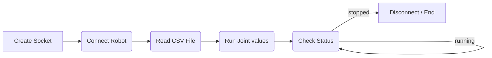

# Robot Hans

## Workflow


- Create Socket
- Connect Robot
  - IP, Port
- Read CSV File
  - CSV file save the joint values
  - Each line have 6 Joint values
  - Each line is a step position
- Run Joint values
  - MoveJ
- Check Status
  - check the status of the robot
  - if stopped, end
  - if running, check again
- End
  - Node end


## Plugin Dev(/Source Code)
C++
```cpp
struct HansCtrlCmmd
	{
		bool  bReadActPos;
		bool  bRobMoveJ;
		bool  bRobEnable;
		bool  bReadActPosFlag;
		bool  bRobMoveJFlag;
		string sRobTartgetPos;
	};
	struct DataCtrl
	{
		string  sClientDataRecv;
		string  sClientDataSend;
		string CSClientDataRecv;
	};
	CTCPClient robotMove;
	DataCtrl TenCom;
	HansCtrlCmmd stRobCtrlCmd;
	QnRtnCode rc1, rc2, rc3, rc;
	std::string port1 = "PosPath";
	std::string port2 = "robotIP";
	std::string port3 = "robotPort";
	std::string PosPath1 = "";
	std::string robotIP1 = "";
	int robotPort1 = 0;
	rc1 = hasProperty(port1);
	rc2 = hasProperty(port2);
	rc3 = hasProperty(port3);

	if (rc1.isSuccess() && rc2.isSuccess() && rc3.isSuccess())
	{
		auto data1 = property(port1);
		auto data2 = property(port2);
		auto data3 = property(port3);
		Json::Reader reader;
		Json::Value root;
		if (reader.parse(data1, root, true))
			if (!root.empty())
				if (root.isObject())
					if (root.isMember("value"))
						if (root["value"].isString())
							PosPath1 = root["value"].asCString();
		if (reader.parse(data2, root, true))
			if (!root.empty())
				if (root.isObject())
					if (root.isMember("value"))
						if (root["value"].isString())
							robotIP1 = root["value"].asCString();
		if (reader.parse(data3, root, true))
			if (!root.empty())
				if (root.isObject())
					if (root.isMember("value"))
						if (root["value"].isInt())
							robotPort1 = root["value"].asInt();

	}

	robotMove.CreateSocket();
	u_short ushortRobotPort1 = static_cast<u_short>(robotPort1);
	int connectResult = robotMove.ConnectSocket(robotIP1.c_str(), ushortRobotPort1);
	robotMove.ReadPosFromCSV(PosPath1);
	std::size_t dataSize = robotMove.GetDataSize();
	for (std::size_t i = 0; i < dataSize; i++)
	{
		try {
			const AuoCtrlData& stAutoDataDo = robotMove.GetDataElement(i);

			string command = "MoveJ,0,";
			stRobCtrlCmd.sRobTartgetPos = "";
			for (int j = 0; j < 6; j++)
			{
				command = command + formatFloatValue(stAutoDataDo.rRobTargetPos[j], 2) + ",";
			}

			stRobCtrlCmd.sRobTartgetPos = command + ";";
			TenCom.sClientDataSend = stRobCtrlCmd.sRobTartgetPos;
			robotMove.TcpSend(TenCom.sClientDataSend);
			TenCom.sClientDataRecv = robotMove.TcpReceive();
			bool CheckSignal = true;
			while (CheckSignal)
			{

				string command1 = "ReadActPos,0,;";

				robotMove.TcpSend(command1);
				Sleep(100);
				TenCom.sClientDataRecv = robotMove.TcpReceive();
				std::vector<std::string> dataParts = robotMove.split(TenCom.sClientDataRecv, ',');
				std::vector<double> jValues(6);
				float ActJoint[6];
				bool bRes[6];
				for (int i = 0; i < 6; ++i)
				{
					ActJoint[i] = std::stod(dataParts[i + 2]);
					if (abs(ActJoint[i] - stAutoDataDo.rRobTargetPos[i]) < 0.5)
					{
						bRes[i] = TRUE;
					}
					else
					{
						bRes[i] = FALSE;
					}
				}

				if ((bRes[0] == true) && (bRes[1] == true) && (bRes[2] == true)
					&& (bRes[3] == true) && (bRes[4] == true) && (bRes[5] == true))
				{
					CheckSignal = FALSE;
				}
				else
				{
					CheckSignal = TRUE;
				}

				Sleep(100);
			}

		}
		catch (const std::out_of_range& e) {
			return rc = -1;
			// Handle error
		}
	}
```

## Documentation from Hans Robot
- [Hans Robot V5 SDK en](https://alidocs.dingtalk.com/i/nodes/mExel2BLV54XByMoHQeO3X2LWgk9rpMq?utm_scene=team_space)
- [Hans Robot Internet Conf ch](https://alidocs.dingtalk.com/i/nodes/m9bN7RYPWdlgYX3KFxZ9NvzzWZd1wyK0?utm_scene=team_space)
## Summary
- The plugin is used to control the Hans Robot. Inside we defined a workflow, which starts from creating socket, connecting to robot, selectting files, checkking the status, disconnectting until robot has finished one times job.