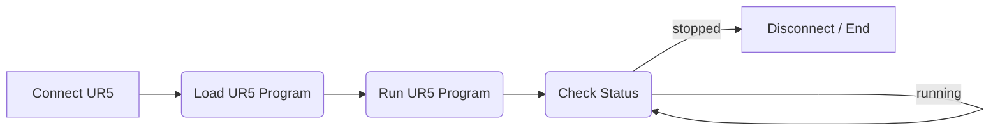

# Robot UR5

## Workflow


- Connect UR5
  - IP, Port
- Load UR5 Program
- Run UR5 Program
  - Send "Play"
- Check Stutus
  - Check the status of the robot
  - If stopped, end
  - If running, check again
- End
  - Node end


## Plugin Dev(/Source Code)
C++
```cpp
std::string ur5ip1 = "192.168.1.200";
    int ur5port1 = 29999;
    std::string ur5proj1 = "Accurancy_TEST_HD_Scanner.urp";
    int ur5time1 = 0;

    WSADATA wsaData;
    SOCKET ConnectSocket = INVALID_SOCKET;
    struct addrinfo* result = NULL, * ptr = NULL, hints;

    // Initialize Winsock
    int iResult = WSAStartup(MAKEWORD(2, 2), &wsaData);
    if (iResult != 0) {
        return 1;
    }

    ZeroMemory(&hints, sizeof(hints));
    hints.ai_family = AF_UNSPEC;
    hints.ai_socktype = SOCK_STREAM;
    hints.ai_protocol = IPPROTO_TCP;

    std::string robot_ip = ur5ip1;
    std::string robot_port = std::to_string(ur5port1);
    // Resolve the server address and port
    iResult = getaddrinfo(robot_ip.c_str(), robot_port.c_str(), &hints, &result);

    if (iResult != 0) {
        //std::cout << "getaddrinfo failed: " << iResult << std::endl;
        WSACleanup();
        return 1;
    }

    // Attempt to connect to the first address returned by the call to getaddrinfo
    ConnectSocket = socket(result->ai_family, result->ai_socktype, result->ai_protocol);
    iResult = connect(ConnectSocket, result->ai_addr, (int)result->ai_addrlen);
    if (iResult == SOCKET_ERROR) {
        closesocket(ConnectSocket);
        ConnectSocket = INVALID_SOCKET;
    }

    freeaddrinfo(result);

    if (ConnectSocket == INVALID_SOCKET) {
        //std::cout << "Unable to connect to server!" << std::endl;
        WSACleanup();
        return 1;
    }

    const char* sendbuf;
    char recvbuf[1024];
    int recvbuflen = 1024;

    memset(recvbuf, 0, recvbuflen);

    // load program
    std::string command = "load ";
    command += ur5proj1;
    command += "\n";
    sendbuf = command.c_str();
    send(ConnectSocket, sendbuf, (int)strlen(sendbuf), 0);

    std::this_thread::sleep_for(std::chrono::milliseconds(100));
    int bytesReceived1 = recv(ConnectSocket, recvbuf, recvbuflen - 1, 0);
    if (bytesReceived1 > 0) {
        recvbuf[bytesReceived1] = '\0';
        std::cout << "Received ASCII data1 isLoaded?: " << recvbuf << std::endl;
    }

    // play program
    std::string command1 = "play ";
    command1 += "\n";
    sendbuf = command1.c_str();
    send(ConnectSocket, sendbuf, (int)strlen(sendbuf), 0);

    std::this_thread::sleep_for(std::chrono::milliseconds(100));
    int bytesReceived2 = recv(ConnectSocket, recvbuf, recvbuflen - 1, 0);
    if (bytesReceived2 > 0) {
        recvbuf[bytesReceived2] = '\0';
        std::cout << "Received ASCII data2 isplayed?: " << recvbuf << std::endl;
    }


    std::this_thread::sleep_for(std::chrono::seconds(1)); // sleep to avoid busy-waiting

    bool checking0 = true;


    while (checking0) {
        std::string command3 = "programState";
        command3 += "\n";
        const char* sendbuf = command3.c_str();
        send(ConnectSocket, sendbuf, (int)strlen(sendbuf), 0);
        int bytesReceived = recv(ConnectSocket, recvbuf, recvbuflen - 1, 0);

        if (bytesReceived > 0) {
            recvbuf[bytesReceived] = '\0';
            std::string recvStr(recvbuf);

            if (recvStr.find("PLAYING") != std::string::npos) {
                std::cout << recvbuf << std::endl;
                checking0 = true;
            }
            else {
                std::cout << recvbuf << std::endl;
                checking0 = false;
            }
        }
        else if (bytesReceived == 0) {
            std::cout << "Connection closed." << std::endl;
            checking0 = false;
        }
        else {
            std::cerr << "recv failed: " << WSAGetLastError() << std::endl;
            checking0 = false;
        }

        std::this_thread::sleep_for(std::chrono::seconds(1)); // sleep to avoid busy-waiting
    }
```

## Documentation from Hans Robot
- [UR Robot](https://alidocs.dingtalk.com/i/nodes/KGZLxjv9VG3RBdyjc5OR0BjmV6EDybno?utm_scene=team_space)

## Summary
- The plugin is used to control the universal Robot. Inside we defined a workflow, which starts from connecting Robot, loading files, selecting files, checking the status, disconnecting until robot has finished one times job.