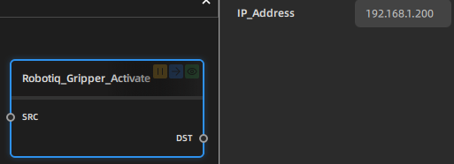
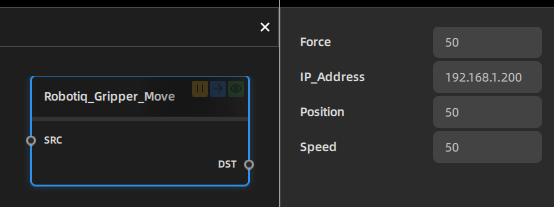
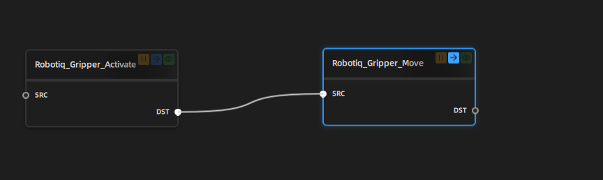

# Robotiq
## 1. What is Robotiq Plugin

Robotiq Plugin is a plugin for QuickNode. It is used to control the Robotiq gripper over socket communication. 

## 2. How to use the plugin
### Step 1: Prepare the nodes from the source code
[Sorce Code](https://github.com/Shining3D-Technology-GmbH/Quicknode_Python.git)
With Source code, you can directly start your plugin development.
### Step 2: Define a workflow for your plugin(Robotiq Plugin)
- Node1: Activate the gripper
  - property: IP address
- Node2: Move the gripper
  - properties:
    - position
    - speed
    - force
## 3. How to use the plugin

- Step 1: Prepare the two nodes
- Step 2: Create a workflow in quicknode:

- Step 3: Run the workflow
- Notice:
1.The value of Force should be between **0 and 100**
2.The value of Speed should be between **0 and 100**
3.The value of Position should be between **0 and 100**
4.Its better to ping the ip address before running the workflow
## 4. Summary
- This plugin is used to control the Robotiq gripper over socket communication.