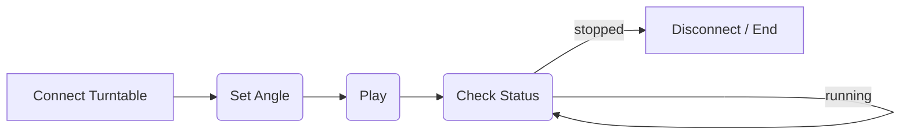

# Turntable
## Device Model
| Parameter | Description |
| --------- | ----------- |
| Model     |  MINAS-A6/A6L  |
| Version   |    --         |
| Manufacturer |    Panasonic     |
## Workflow

## Plugin Dev(/Source Code)
C++
```cpp
//------------------Main Workflow--------------------------
int rc1 = turnTableMove.ConnectTurnTable();

	QnRtnCode rc,rc3;
	std::string port1 = "TurnTableAngle";
	float TurnTableAngle = 0;
	rc3 = hasProperty(port1);
	if (rc3.isSuccess())
	{
		auto data1 = property(port1);
		Json::Reader reader;
		Json::Value root;
		if (reader.parse(data1, root, true))
			if (!root.empty())
				if (root.isObject())
					if (root.isMember("value"))
						if (root["value"].isNumeric())
							TurnTableAngle = root["value"].asFloat();
	}
	turnTableMove.loadAngleCompensationValue();
	bool rc2 = turnTableMove.ReadAndAdjustAngle(TurnTableAngle, turnTableMove.DegreeCom);

	turnTableMove.CloseAndReleaseResources();


```
```cpp
//------------------TurnTableClient--------------------------
int CTCPClient::ConnectTurnTable()
{
	
	RTUctx = modbus_new_rtu("COM5", 38400, 'N', 8, 1);
	if (RTUctx == NULL)
	{
		std::cout << "Unable to create the libmodbus context\n";
		return -1;
	}

	CmdRet = modbus_set_slave(RTUctx, 1);
	CmdRet = modbus_connect(RTUctx);
	CmdRet = modbus_write_bit(RTUctx, 288, STB_OFF);
	CmdRet = modbus_write_bit(RTUctx, 96, SRVO_ON);
	CmdRet = modbus_write_register(RTUctx, 17428, AbsMove);
	CmdRet = modbus_read_registers(RTUctx, 17429, 1, InvidBlockNo);
	CmdRet = modbus_read_registers(RTUctx, 17430, 1, DataBlocNO);
	CmdRet = modbus_read_bits(RTUctx, 160, 4, DataReady);
}
bool CTCPClient::ReadAndAdjustAngle(float targetAngle, float angleCompensation)
{
	CmdRet = modbus_read_registers(RTUctx, 16898, 3, DataEnco);
	if (DataEnco[2] != 65535)
	{
		bEncoErr = FALSE;
		rTurnTableActAngle = (DataEnco[2] * 8388608 + (DataEnco[0] + DataEnco[1] * 65535)) / (8388608 * 50 / 360.0) - angleCompensation;

	}
	else
	{
		rTurnTableActAngle = 0.0;
		bEncoErr = TRUE;
	}
	uint16_t ActPos[4];
	ActPos[0] = 0;
	ActPos[1] = 512;
	ActPos[2] = (targetAngle + angleCompensation) * 150 ;
	ActPos[3] = 0;
	CmdRet = modbus_write_registers(RTUctx, 18440, 4, ActPos);

	CmdRet = modbus_write_bit(RTUctx, 288, STB_ON);
	Sleep(500);
	while (CmdRet > 0)
	{
		
		CmdRet = modbus_read_registers(RTUctx, 16898, 3, DataEnco);
		if (DataEnco[2] != 65535)
		{
			bEncoErr = FALSE;
			rTurnTableActAngle = (DataEnco[2] * 8388608 + (DataEnco[0] + DataEnco[1] * 65535)) / (8388608 * 50 / 360.0) - angleCompensation;
		}
		else
		{
			rTurnTableActAngle = 0.0;
			bEncoErr = FALSE;
		}
		CmdRet = modbus_read_bits(RTUctx, 160, 4, DataReady);
		if ((abs(rTurnTableActAngle - targetAngle) < 0.1) && (DataReady[2] == 1))
		{
			CmdRet = modbus_write_bit(RTUctx, 288, STB_OFF);
			bTableArrived = TRUE;
			break;
		}
		Sleep(100);

	}

	return 0;
}
void CTCPClient::CloseAndReleaseResources()
{
	modbus_close(RTUctx);
	modbus_free(RTUctx);
	data.clear();
}
```
## Documentation from Turntable
- [Turntable Manual](https://alidocs.dingtalk.com/i/nodes/m9bN7RYPWdlgYX3KFxZAe4N3WZd1wyK0?utm_scene=team_space)

## 
## Summary
The turntable is a device that can rotate the object to a specific angle. It is used to rotate the object to a specific angle for scanning or other purposes.